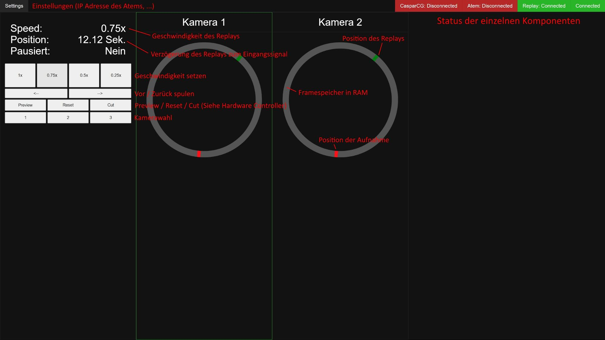
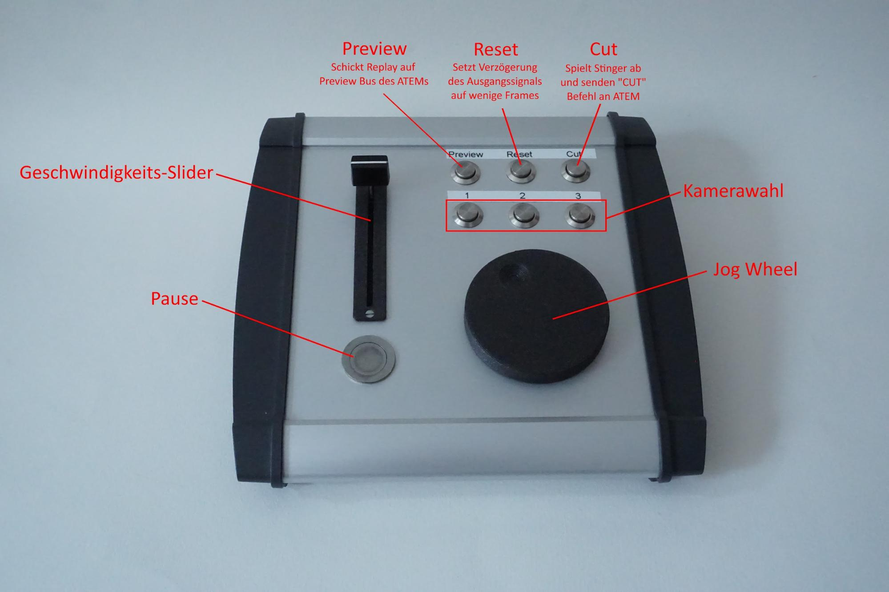
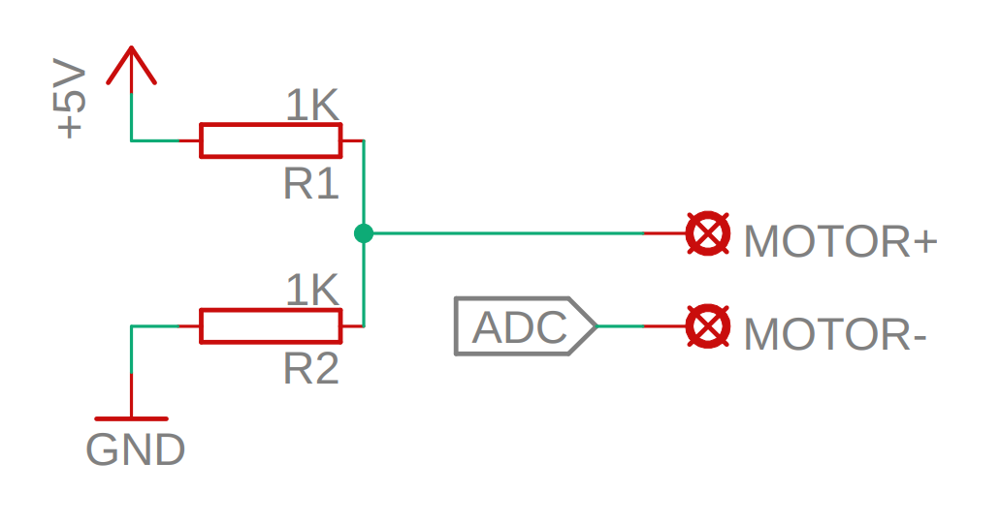

# Decklink Instant-Replay

This is a Software for Instant Replay in live sports productions with very low CPU / GPU requirements. For SDI Inputs / Outputs it uses a Blackmagic Decklink Card(tested with a Decklink 2 Duo).

## Features

* Uncompressed continuous recording of 2 SDI Inputs into RAM (3 theoretically possible but untested)
* SDI Output for replaying recorded Inputs
* Playback of recorded signals in Slow Motion
* Arduino based Hardware Controller with Jog Wheel
* Control via Web-App
* Integration with ATEM Switchers
* Playout of Stinger with CasparCG(not fully usable) or Web-App (Browser Source in vMix / OBS / CasparCG)

## Motivation / Core Principles

The motivation behind writing this software was wanting a really low cost Instant Replay solution to work together with ATEM Switchers. Most other solutions record all input signals on SSDs. This has multiple advantages, like being able to use those video files for highlight videos and such, but also has the disadvantage that the input signals need to be compressed because of limited write speeds of most SSDs. Compression requires computing power, which in turn costs money.
This software records to RAM instead, which is plenty fast enough to write multiple uncompressed 8-bit YUV signals to.
The SDI Output is basically a delayed version of one of the Input signals (selectable using the Web-App or Hardware Controller). How much this signal is delayed can also be adjusted in the Web-App or on the Hardware Controller using the Jog Wheel. This makes it possible to have the Output almost be live and then if something happens that needs to be replayed, the Output can be rewound to before the Event. After this, a cut to the Replay can be triggered from the Web-App / Hardware Controller, which plays out the Stinger(either via a Browser Source or CasparCG) and sends a command to the Atem to cut to the Input the Replay System is connected to at the appropriate time. The same process is used to cut back from the Replay.
While playing the Replay, the speed can be changed using the Web-App or the Fader on the Hardware Controller. This happens in steps, so currently there are 4 Speeds available: 100%, 75%, 50%, 25%.

## Hardware Requirements

The only real requirement in terms of Hardware is RAM Size. Except that, any PC that's not super old and has the appropriate PCIe slot for a Decklink Card should work.

The needed RAM Size is dependant on multiple Factors:

* Input Resolution (1080p will be assumed in the following calculations)
* Input Framerate
* Number of Inputs

It can be calculated using the following Formula:

2 \* 1920 \* 1080 \*FPS \* SECONDS \* COUNT = RAM Size in Bytes

FPS = Framerate of Input / Output Signals

SECONDS = How many Seconds of the recordings should be accessible for Replays at all times (e.g. 30 Seconds => The Output can be delayed to a max. of 30 seconds from the current time)

COUNT = Count of Input Signals (tested with 2)

About 2GB should be added to the result for the OS / everything else that needs RAM.

## Installation

(Steps might be missing, written down from memory)

1. Install Ubuntu 20.04 (tested with Ubuntu Desktop, but should work without GUI)
2. Install Blackmagic Desktop Video
3. Clone this Repository to /home/instantreplay/decklink-instantreplay
4. Run install.sh (This will copy the SystemD service configs to the appropriate location)
5. Enable Services:
    * `systemctl enable instantreplay_core`
    * `systemctl enable instantreplay_replay`
    * `systemctl enable instantreplay_client`
    * `systemctl enable instantreplay_arduino`
    * `systemctl enable instantreplay_obs`
6. Reconfigure for FPS / Resolution / RAM Size / ATEM IP etc.
    * Basic Config is in config.js and at the top of coreServer/index.js
6. Reboot

The Web-App should now be available on http://IP-OF-PC:8080

## Hardware Controller

The Hardware Controller consists of the following Parts:

* Arduino Uno (sketch in arduinoClient/arduino/arduino.ino)
* 7 momentary buttons
* Fader (faders found in audio mixers typically have a LOG curve which gets adjusted for in software)
* Jog Wheel using a small DC Motor from a CD drive

The Fader is connected to A1 of the Arduino as a Voltage Divider between GND and 5v.

One Pole of the DC Motor is connected to A0 of the Arduino, the other one is connected to a voltage divider consisting of 2 1k Ohm Resistors between 5v and GND, to place the Pole of the motor at 2.5V(Picture below).

The Pushbuttons are connected between Pins 2-8 of the Arduino and GND.

## Pictures

### Web Client (Labels in German)

### Hardware Controller (Labels in German)

